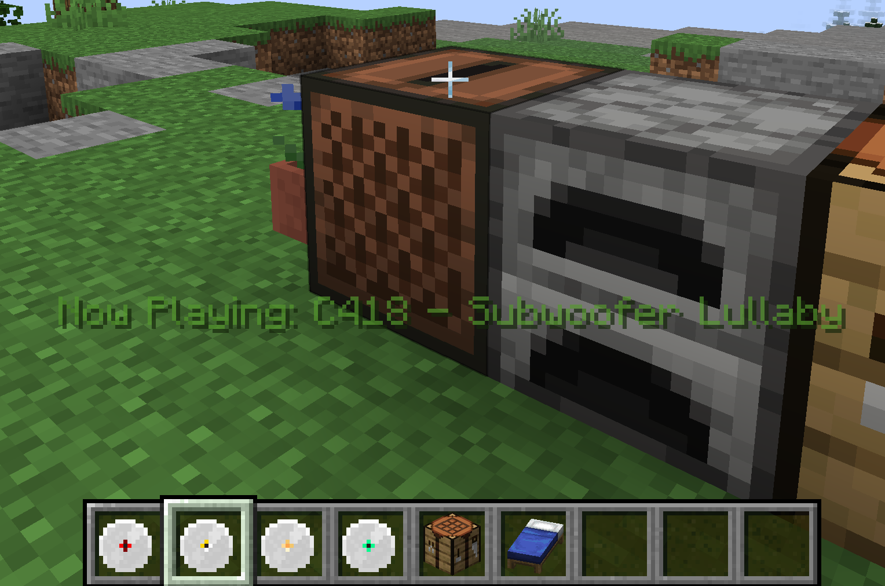

# OST Discs

A minecraft mod which adds C418's original minecraft soundtrack as playable music discs.

Currently, discs may be found in the Creative Menu or will be dropped by Creepers when killed by a Skeleton (exactly as Vanilla discs).

I would like to thank KaupenJoe for his wonderful Fabric tutorial, found on his [youtube channel](https://www.youtube.com/@ModdingByKaupenjoe).

## Version: Fabric 1.21 **[FABRIC API REQUIRED]**

## Minecraft OST (C418 Volume Alpha):

1. Key – 01:05  
2. Door – 01:51  
3. Subwoofer – Lullaby 03:28  
4. Death – 00:41  
5. Living Mice – 02:57  
6. Moog City – 02:40  
7. Haggstrom – 03:24  
8. Minecraft – 04:14  
9. Oxygène – 01:05  
10. Équinoxe – 01:54  
11. Mice on Venus – 04:41  
12. Dry Hands – 01:08  
13. Wet Hands – 01:30  
14. Clark – 03:11  
15. Chris – 01:27  
16. Thirteen – 02:56  
17. Excuse – 02:04  
18. Sweden – 03:35  
19. Cat – 03:06  
20. Dog – 02:25  
21. Danny – 04:14  
22. Beginning – 01:42  
23. Droopy likes ricochet – 01:36  
24. Droopy likes your face – 01:56

## C418 Minecraft OST v2 (C148 Volume Beta): **(PLANNED)**

### Note: This volume excludes the discs from the album already part of the game.

1. Ki – 01:32
2. Alpha – 10:03
3. Dead Voxel – 04:56
4. Blind Spots – 05:32
5. Flake – 02:50
6. Moog City 2 – 03:00
7. Concrete Halls – 04:14
8. Biome Fest – 06:18
9. Mutation – 03:05
10. Haunt Muskie – 06:01
11. Warmth – 03:59
12. Floating Trees – 04:04
13. Aria Math – 05:10
14. Kyoto – 04:09
15. Ballad of the Cats – 04:35
16. Taswell – 08:35
17. Beginning 2 – 02:56
18. Dreiton – 08:17
19. The End – 15:04
20. Intro – 04:36  